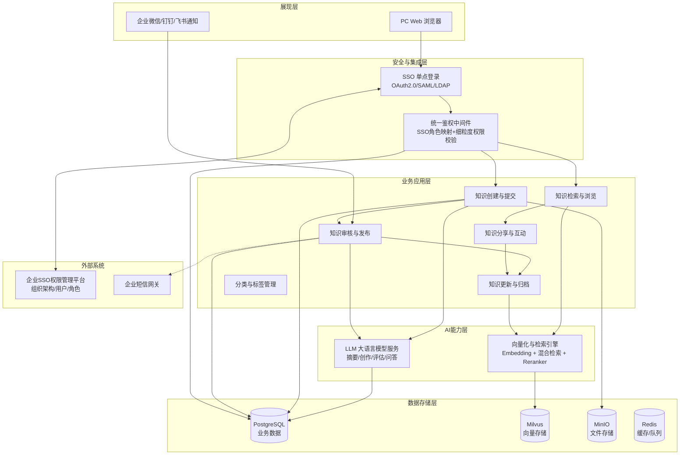
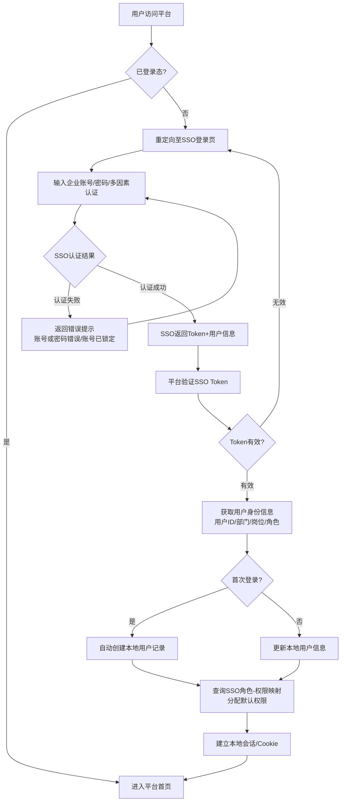
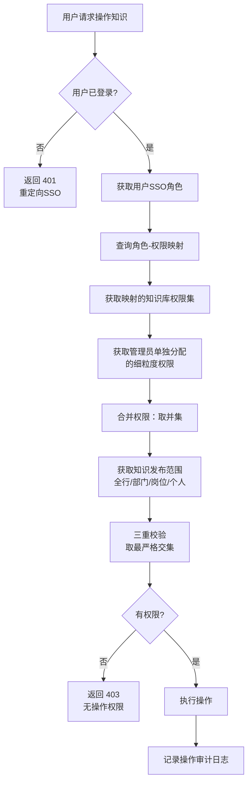
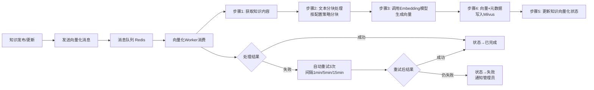
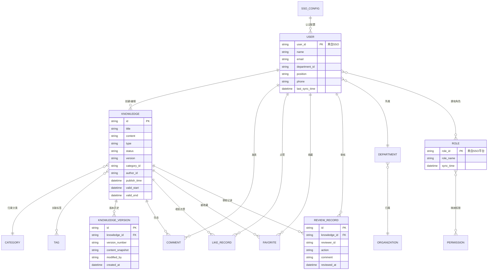
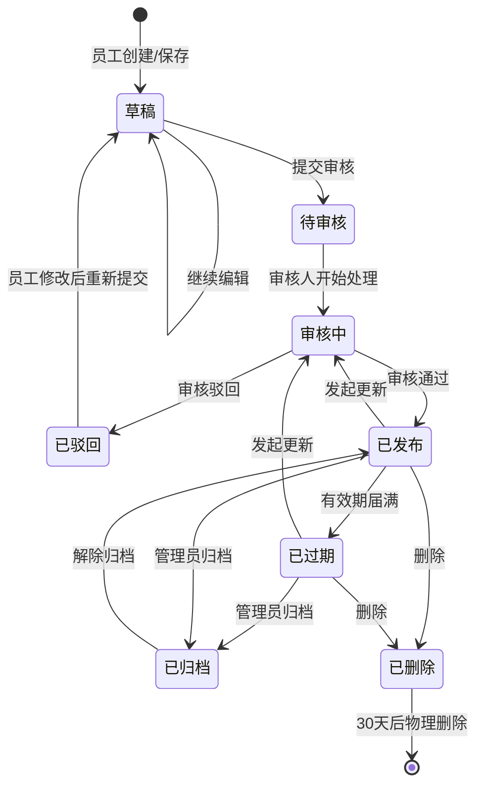
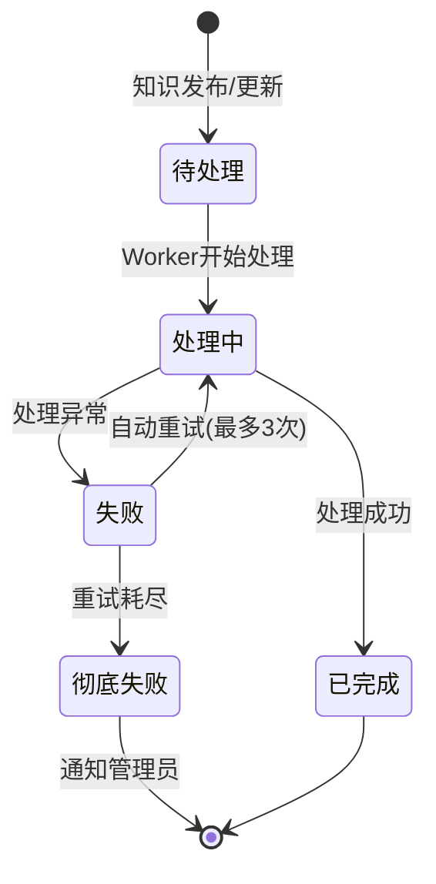

# 知行 · KnowDo
# 企业级AI知识库平台
# 产品需求文档（PRD）

| 文档信息 | 内容 |
|:---|:---|
| **产品名称** | 知行（KnowDo） |
| **产品定位** | 企业级AI知识库平台 |
| **产品口号** | 知以致用，行而致远 |
| **文档版本** | V2.0 |
| **文档状态** | 待评审 |
| **创建日期** | 2026-06-22 |
| **目标用户** | 企业内部全体员工（总行/分支行/部门/岗位） |
| **核心价值** | 统一知识沉淀、智能高效检索、AI辅助创作、权限与SSO深度融合 |

---

### 命名释义

**知行**，取自「知行合一」—— 知为行之始，行为知之成。

英文名 **KnowDo**，由两个核心词组合而成，同时可展开为以下缩写定义：

| 字母 | 代表词汇 | 释义 |
|:---|:---|:---|
| **K** | **Knowledge** | 知识沉淀与管理 |
| **N** | **Navigation** | 精准检索与导航 |
| **O** | **Organization** | 结构化分类与组织 |
| **W** | **Wisdom** | AI驱动的智慧赋能 |
| **D** | **Discovery** | 智能发现与推荐 |
| **O** | **Operation** | 知识应用于业务 |

> **KnowDo = Knowledge Navigation & Organization with Wisdom, Discovery and Operation**
>
> 知以致用，行而致远。知识不止于存储，更在于精准触达、智慧赋能与业务落地。

---

## 目录

1. 产品概述
2. 用户角色定义
3. 产品架构图
4. 核心业务流程图
5. 功能需求详述
6. 非功能性需求
7. 数据模型概要
8. 验收标准
9. 附录：术语表


## 一、产品概述

### 1.1 产品背景

企业内部知识分散在个人电脑、共享文件夹、邮件附件、即时通讯记录中，面临三大核心痛点：

- **知识孤岛**：各部门知识独立存储，跨部门检索困难，重复建设严重
- **经验流失**：员工离职带走隐性经验，新员工上手成本高
- **合规风险**：制度文件版本混乱，无法确认员工是否已读关键政策

### 1.2 产品定位

面向企业的一站式AI知识管理平台，覆盖知识的**创建、审核、存储、检索、互动、更新、归档**全生命周期。通过**大语言模型与向量检索技术**，将被动存储的知识库升级为主动赋能员工的**企业智慧大脑**。

### 1.3 核心价值主张

| 维度 | 传统知识库 | 本产品 |
|:---|:---|:---|
| **检索方式** | 关键词匹配，查不全、查不准 | 语义理解+混合检索，自然语言精准问答 |
| **知识质量** | 依赖个人自觉，格式混乱 | 模板+AI评估+审核流程，质量可控 |
| **权限安全** | 粗粒度，独立管理，安全隐患大 | 对接企业SSO权限管理平台，角色自动同步，精确到单篇 |
| **运营闭环** | 发布即结束，无反馈 | 评论/点赞/收藏/版本/有效期，全生命周期管理 |

### 1.4 产品边界

**本期范围（V1.0）**：

- 知识全生命周期管理（创建→审核→发布→检索→互动→更新→归档）
- 用户认证（对接企业SSO单点登录）
- 权限管理体系（对接企业统一SSO权限管理平台，同步组织架构/角色/用户）
- AI智能增强（摘要、辅助创作、质量评估、标签推荐）
- 模型与向量化管理（多模型接入、向量化流水线）

**本期不包含**：

- 数据运营看板与分析报表
- 部门知识门户
- 移动端独立APP
- 知识专家网络
- OCR/ASR全文检索增强
- 知识关联图谱


## 二、用户角色定义

| 角色名称 | 职责描述 | 核心需求场景 |
|:---|:---|:---|
| **普通员工** | 知识的主要消费者和贡献者 | 通过SSO登录、创建知识、检索知识、浏览、收藏、评论点赞、接收发布通知 |
| **审核人** | 知识的质量把关者 | 审核提交的知识（通过/驳回/退回）、查看AI质量评估建议 |
| **知识管理员** | 知识库的日常维护者 | 管理分类/标签、归档知识、处理过期知识、管理版本、维护回收站 |
| **系统管理员** | 平台的整体管理者 | 配置SSO集成、配置角色-权限映射、配置审核流程、配置模型接入、查看向量化任务 |

> **说明**：以上角色（除知识管理员外）均来源于企业SSO权限管理平台，通过角色映射机制获得知识库内对应权限。知识管理员为企业SSO权限管理平台中的特定角色或在知识库内单独配置的管理角色。


## 三、产品架构图




## 四、核心业务流程图

### 4.1 用户认证与鉴权流程



### 4.2 知识全生命周期流程

```mermaid
flowchart TD
    A[普通员工SSO登录] --> B[创建知识]
    B --> C{操作选择}
    C -->|保存草稿| D[草稿箱<br/>可随时编辑修改]
    D --> B
    C -->|提交审核| E[知识状态→待审核]
    E --> F[向第一位审核人发送待办通知]
    F --> G[审核人查看内容/AI评估报告]
    G --> H{审核操作}
    H -->|驳回| I[填写驳回原因<br/>通知提交人]
    I --> B
    H -->|退回修改| J[填写修改意见<br/>通知提交人]
    J --> B
    H -->|通过| K{是否为最后审核节点?}
    K -->|否| L[流转至下一审核人]
    L --> G
    K -->|是| M[自动发布]
    M --> N[状态→已发布<br/>版本号→V1.0]
    N --> O[多渠道通知<br/>站内信/短信/APP推送]
    N --> P[触发向量化任务]
    P --> Q[员工浏览/检索/评论点赞/收藏]
    Q --> R{作者发起更新?}
    R -->|是| S[进入编辑页<br/>原内容回填]
    S --> T[修改后重新提交审核]
    T --> G
    T --> U[审核通过→版本号+1]
    U --> P
    Q --> V{有效期即将届满?}
    V -->|是| W[到期前7天/1天提醒]
    W --> X{逾期未更新?}
    X -->|是| Y[自动标记"已过期"]
    Y --> Z1[管理员归档或删除]
    Z1 --> Z2[入回收站<br/>30天可恢复]
```

### 4.3 权限校验流程



### 4.4 向量化处理流程




## 五、功能需求详述

### 功能清单总览

| 模块编号 | 模块名称 | 功能点数 | P0 | P1 | P2 |
|:---|:---|:---|:---|:---|:---|
| 一 | 知识创建与提交 | 5 | 4 | 1 | 0 |
| 二 | 知识审核与发布 | 4 | 3 | 1 | 0 |
| 三 | 知识存储与分类 | 4 | 3 | 1 | 0 |
| 四 | 知识检索与浏览 | 4 | 2 | 1 | 1 |
| 五 | 知识分享与互动 | 4 | 0 | 3 | 1 |
| 六 | 知识更新与归档 | 4 | 1 | 3 | 0 |
| 七 | 权限管理（对接SSO平台） | 4 | 4 | 0 | 0 |
| 八 | AI智能增强 | 4 | 1 | 3 | 0 |
| 九 | 模型与向量化管理 | 6 | 5 | 1 | 0 |
| 十 | 用户认证与SSO集成 | 1 | 1 | 0 | 0 |
| **总计** | | **40** | **24** | **14** | **2** |


### 模块一：知识创建与提交

#### F-01 多类型知识创建

| 项目 | 内容 |
|:---|:---|
| **优先级** | 🟠 P0 |
| **用户角色** | 普通员工 |
| **功能描述** | 用户可创建多种类型的知识条目，系统根据知识类型提供差异化的编辑入口和字段配置 |

**支持的知识类型**：

| 知识类型 | 支持格式 | 编辑器特性 |
|:---|:---|:---|
| 文档类 | Word(.doc/.docx)、Excel(.xls/.xlsx)、PDF | 支持在线预览编辑、附件上传 |
| 图片类 | JPG、PNG、GIF、BMP | 图片上传预览、支持多图批量上传 |
| 视频类 | MP4、AVI、MOV | 视频上传、在线播放预览 |
| 音频类 | MP3、WAV、WMA | 音频上传、在线播放预览 |
| 链接类 | URL | 输入链接地址，系统自动抓取标题和摘要 |
| 问答类 | 文本 | 问题+答案的结构化编辑 |

**前置条件**：用户已通过SSO登录，具有知识创建权限

**主要流程**：
1. 用户点击「新建知识」按钮
2. 系统弹出类型选择窗口，展示6种知识类型
3. 用户选择一种类型后，进入对应编辑器
4. 用户完成编辑后，可保存草稿或提交审核

**异常处理**：
- 文件格式不支持：提示"不支持的文件格式，支持格式：xxx"
- 文件超过大小限制：提示"文件大小超过限制（最大xx MB）"
- 上传中断：支持断点续传，提示"上传中断，已保存xx%，可继续上传"

**验收标准**：
- [ ] 6种知识类型均能正常创建
- [ ] 各类型编辑器正常加载对应功能
- [ ] 文件上传大小限制可配置并生效
- [ ] 不支持的文件格式被正确拦截并有明确提示


#### F-02 标准化编辑模板

| 项目 | 内容 |
|:---|:---|
| **优先级** | 🟠 P0 |
| **用户角色** | 普通员工 |
| **功能描述** | 系统提供按知识分类和岗位预设的标准化模板，用户创建知识时自动加载对应模板，确保知识格式统一、必填项完整 |

**模板必填项**：

| 字段 | 类型 | 是否必填 | 说明 |
|:---|:---|:---|:---|
| 标题 | 文本输入 | 必填 | 知识名称，限制100字以内 |
| 知识分类 | 级联选择 | 必填 | 三级分类选择器 |
| 关键词标签 | 多选+输入 | 必填 | 至少选择1个标签 |
| 发布范围 | 单选/多选 | 必填 | 全行可见/部门可见/特定岗位可见 |
| 有效期 | 日期选择 | 必填 | 开始日期~结束日期，或选择"永久有效" |
| 正文内容 | 富文本 | 必填 | 根据模板预设结构 |
| 附件 | 文件上传 | 选填 | 支持多个附件 |

**前置条件**：管理员已配置模板

**主要流程**：
1. 用户选择知识类型后，系统自动匹配模板
2. 用户选择知识分类和岗位时，模板可动态切换
3. 必填项未填写时，「提交」按钮置灰不可点击
4. 鼠标悬停必填项标签时显示"此项为必填"

**验收标准**：
- [ ] 不同分类/岗位展示不同模板
- [ ] 所有必填项未填写完整时，提交按钮不可点击
- [ ] 必填项缺失时有明确高亮提示


#### F-03 在线富文本编辑

| 项目 | 内容 |
|:---|:---|
| **优先级** | 🟠 P0 |
| **用户角色** | 普通员工 |
| **功能描述** | 提供功能完善的所见即所得在线编辑器，支持文字排版、多媒体插入、附件上传 |

**功能清单**：
- 文字格式：加粗、斜体、下划线、删除线、字号、字体颜色、背景色
- 段落格式：居左/居中/居右、有序列表、无序列表、缩进、行间距
- 插入功能：图片、视频、表格、超链接、分隔线、代码块、引用块
- 附件上传：拖拽或点击上传，显示文件名和大小
- 撤销/重做：支持快捷键 Ctrl+Z / Ctrl+Y

**异常处理**：
- 粘贴外部内容时，自动清除多余格式，保留纯文本基本格式
- 图片过大时自动压缩（超过1920px宽度等比例缩放）

**验收标准**：
- [ ] 所有格式按钮功能正常
- [ ] 图片/视频/附件上传功能正常
- [ ] Ctrl+Z/Y 快捷键正常
- [ ] 粘贴Word内容时格式清理正常


#### F-04 知识提交审核

| 项目 | 内容 |
|:---|:---|
| **优先级** | 🟠 P0 |
| **用户角色** | 普通员工 |
| **功能描述** | 用户完成知识编辑后，确认元数据信息并提交至审核流程 |

**主要流程**：
1. 用户点击「提交审核」按钮
2. 系统弹出确认窗口，汇总展示：
    - 知识标题
    - 所选分类（完整路径）
    - 发布范围
    - 有效期
    - 审核流程（展示审核节点）
3. 用户确认无误，点击「确认提交」
4. 系统执行：
    - 知识状态变更为「待审核」
    - 草稿自动清除
    - 向第一位审核人发送待办通知
    - 记录操作日志

**异常处理**：
- 必填项未完成：弹出提示，定位到首个未完成项
- 网络异常：提示"提交失败，请检查网络后重试"

**验收标准**：
- [ ] 提交确认窗口信息展示完整准确
- [ ] 提交后状态正确变更
- [ ] 审核人正确收到待办通知
- [ ] 草稿提交后自动清除


#### F-05 草稿保存

| 项目 | 内容 |
|:---|:---|
| **优先级** | 🔵 P1 |
| **用户角色** | 普通员工 |
| **功能描述** | 用户在编辑知识过程中，系统自动保存草稿，避免因意外关闭导致内容丢失 |

**主要流程**：
1. 用户进入编辑器后，系统每30秒自动保存一次草稿
2. 用户也可手动点击「保存草稿」按钮
3. 草稿列表在「我的知识」→「草稿箱」中查看
4. 草稿可继续编辑、删除
5. 草稿保留30天，过期自动清理并提醒用户

**验收标准**：
- [ ] 自动保存功能正常（30秒间隔）
- [ ] 意外关闭浏览器后，重新打开可恢复草稿
- [ ] 草稿箱中可查看/编辑/删除草稿
- [ ] 过期草稿自动清理并有提醒


### 模块二：知识审核与发布

#### F-06 分级审核机制

| 项目 | 内容 |
|:---|:---|
| **优先级** | 🟠 P0 |
| **用户角色** | 系统管理员 |
| **功能描述** | 管理员可根据知识类型、重要程度、发布范围，自定义配置多级审核流程 |

**审核流程配置项**：

| 配置项 | 说明 |
|:---|:---|
| 流程名称 | 自定义，如"部门级知识审核流程" |
| 适用规则 | 按知识分类/发布范围/提交人岗位等条件匹配 |
| 审核节点 | 支持1~3级审核，每级可指定具体人员或岗位 |
| 节点类型 | 单人审批（任一人通过即可）/ 多人会签（所有人通过） |
| 超时处理 | 超过N小时未审核，自动提醒或升级到上级 |

**示例配置**：
```
流程名称：重要制度审核
适用规则：分类=规章制度 AND 发布范围=全行可见
审核节点：
  ├─ 节点1：提交人部门负责人（单人审批，超时24h提醒）
  └─ 节点2：总行合规部负责人（单人审批）
```

**验收标准**：
- [ ] 支持创建/编辑/删除审核流程
- [ ] 支持多级审核节点配置
- [ ] 支持按条件规则匹配流程
- [ ] 超时提醒机制正常工作


#### F-07 审核操作

| 项目 | 内容 |
|:---|:---|
| **优先级** | 🟠 P0 |
| **用户角色** | 审核人 |
| **功能描述** | 审核人在待办列表中处理待审核知识，可查看完整内容并进行通过、驳回、退回修改操作 |

**审核界面布局**：

| 区域 | 内容 |
|:---|:---|
| 左侧/上区 | 知识正文预览（标题、正文、附件可下载预览） |
| 右侧/下区 | AI质量评估结果（格式规范性、完整性、查重结果、敏感信息提示） |
| 操作栏 | [通过] [驳回] [退回修改] 按钮 + 审批意见输入框 |

**操作逻辑**：

| 操作 | 说明 | 必填条件 |
|:---|:---|:---|
| **通过** | 流转至下一审核节点，或（最后节点）自动发布 | 无 |
| **驳回** | 审核流程终止，知识退回给提交人 | 必须填写驳回原因 |
| **退回修改** | 审核流程暂停，知识退回给提交人，修改后可再次提交 | 必须填写修改意见 |

**验收标准**：
- [ ] 审核人可查看知识正文和所有附件
- [ ] 通过/驳回/退回三种操作均正常
- [ ] 驳回/退回时，意见为必填
- [ ] 操作后提交人正确收到通知


#### F-08 自动发布

| 项目 | 内容 |
|:---|:---|
| **优先级** | 🟠 P0 |
| **用户角色** | 系统自动 |
| **功能描述** | 知识通过最终审核后，系统按预设规则自动发布至指定分类和范围 |

**发布逻辑**：
1. 审核流程最后一个节点通过
2. 系统检查知识属性中的「发布时间」：
    - 若为"立即发布"：立即变更状态为「已发布」
    - 若为"定时发布"：进入发布队列，到设定时间自动发布
3. 发布后执行：
    - 知识状态 → 「已发布」
    - 版本号 → V1.0（首次）或递增
    - 触发多渠道通知（F-09）
    - 触发向量化任务（M-05）

**异常处理**：
- 定时发布失败（如分类已被删除）：通知管理员人工处理

**验收标准**：
- [ ] 审核通过后立即发布正常
- [ ] 定时发布按设定时间正常执行
- [ ] 发布后版本号正确生成
- [ ] 发布后状态正确


#### F-09 发布通知

| 项目 | 内容 |
|:---|:---|
| **优先级** | 🔵 P1 |
| **用户角色** | 系统自动 |
| **功能描述** | 知识发布后，向发布范围内的员工发送多渠道通知，确保新知识被及时知晓 |

**通知渠道与触发规则**：

| 通知渠道 | 触发条件 | 内容格式 |
|:---|:---|:---|
| **站内消息** | 所有知识发布（默认） | 完整通知（标题+分类+摘要+链接） |
| **短信** | 仅重要知识（管理员配置，如全行可见制度文件） | 精简版：`【知识库】《[标题]》已发布，请及时查看。` |
| **APP推送** | 集成后默认启用 | 同站内消息格式 |

**通知内容模板（站内消息）**：
```
📢 新知识发布通知

《[知识标题]》已于 [日期] 发布

分类：[一级分类] > [二级分类] > [三级分类]
作者：[作者姓名]

[AI摘要：前100字...]

👉 点击查看详情
```

**验收标准**：
- [ ] 发布范围内员工正确收到站内消息
- [ ] 通知内容包含知识标题、分类、摘要
- [ ] 点击通知可跳转至知识详情页
- [ ] 短信通知可按配置触发


### 模块三：知识存储与分类

#### F-10 统一存储与备份

| 项目 | 内容 |
|:---|:---|
| **优先级** | 🟠 P0 |
| **用户角色** | 系统管理员 |
| **功能描述** | 所有知识附件统一存储至对象存储，数据库与文件均支持定期备份与恢复 |

**技术方案**：
- **文件存储**：MinIO对象存储，按知识ID组织目录结构
- **数据库**：PostgreSQL主从架构
- **备份策略**：
    - 数据库：每日凌晨全量备份，保留最近30天
    - 文件存储：每日增量同步至异地存储
- **恢复演练**：每季度执行一次备份恢复测试

**验收标准**：
- [ ] 文件上传后可在MinIO中正确组织存储
- [ ] 数据库备份任务正常运行
- [ ] 文件备份任务正常运行
- [ ] 备份数据可成功恢复


#### F-11 多级分类管理

| 项目 | 内容 |
|:---|:---|
| **优先级** | 🟠 P0 |
| **用户角色** | 知识管理员 |
| **功能描述** | 管理员可维护最多三级的树形分类体系，分类支持增删改排序，可根据业务发展动态调整 |

**分类示例**：
```
├── 公司业务
│   ├── 信贷业务
│   │   ├── 企业贷款
│   │   └── 个人贷款
│   └── 存款业务
├── 个人业务
├── 风险管理
│   ├── 信用风险
│   └── 操作风险
├── 运营管理
├── 人力资源
└── 行政办公
```

**操作约束**：
- 删除分类前需确保其下无子分类和知识
- 分类名称同级不可重复
- 支持拖拽排序

**验收标准**：
- [ ] 三级分类树正常展示
- [ ] 分类增删改操作正常
- [ ] 删除有子节点的分类时给出正确提示
- [ ] 拖拽排序生效


#### F-12 标签管理

| 项目 | 内容 |
|:---|:---|
| **优先级** | 🔵 P1 |
| **用户角色** | 知识管理员、普通员工 |
| **功能描述** | 管理员维护全局标签库，员工创建知识时可选择标签，系统自动进行标签匹配，支持AI自动推荐标签（关联F-33） |

**标签属性**：
- 标签名称（唯一）
- 标签颜色（可选）
- 所属标签组（如"业务类型"、"产品线"）
- 使用次数（自动统计）

**验收标准**：
- [ ] 标签库增删改查正常
- [ ] 创建知识时可从标签库选择
- [ ] 标签使用次数自动统计
- [ ] AI标签推荐功能正常


#### F-13 知识版本管理

| 项目 | 内容 |
|:---|:---|
| **优先级** | 🟠 P0 |
| **用户角色** | 所有用户 |
| **功能描述** | 知识每次更新发布后自动生成新版本，支持查看历史版本和回滚操作 |

**版本规则**：
- 版本号格式：V1.0, V2.0, V3.0...
- 版本记录信息：版本号、修改人、修改时间、变更说明
- 每个版本保留完整的正文内容和附件快照

**回滚逻辑**：
1. 用户在历史版本列表中选择目标版本
2. 点击「回滚到此版本」
3. 系统二次确认
4. 确认后，历史版本内容覆盖当前内容，生成新版本号

**验收标准**：
- [ ] 知识更新后版本号自动递增
- [ ] 历史版本列表完整可查看
- [ ] 历史版本内容可查看（正文+附件）
- [ ] 回滚功能正常，回滚后生成新版本


### 模块四：知识检索与浏览

#### F-14 多维度检索

| 项目 | 内容 |
|:---|:---|
| **优先级** | 🟠 P0 |
| **用户角色** | 所有用户 |
| **功能描述** | 提供多维度、多模式的检索能力，帮助员工快速定位所需知识 |

**检索模式**：

| 模式 | 说明 | 实现方式 |
|:---|:---|:---|
| 关键词检索 | 输入关键词，匹配标题、正文、标签 | BM25倒排索引 |
| 语义检索 | 输入自然语言描述，理解意图匹配 | 向量相似度检索 |
| 混合检索 | 关键词+语义综合排序 | BM25 + 向量，可配置权重 |

**筛选维度**：
- 按分类筛选（级联选择器）
- 按标签筛选（多选）
- 按作者筛选（员工搜索选择器）
- 按时间范围筛选（创建时间/更新时间）
- 按知识类型筛选（文档/图片/视频/音频/链接/问答对）

**检索类型**：
- 模糊检索：输入部分关键词即可匹配相关内容
- 精确检索：使用引号包裹关键词，精确匹配
- 组合检索：多条件叠加（如"分类=风险管理 AND 作者=张三"）

**排序方式**：
- 综合相关性（默认）、最新发布、最多浏览、最多收藏、最多点赞

**验收标准**：
- [ ] 关键词检索返回结果准确
- [ ] 语义检索能理解近义词和意图
- [ ] 混合检索排序合理
- [ ] 所有筛选维度和检索类型正常工作


#### F-15 检索结果展示

| 项目 | 内容 |
|:---|:---|
| **优先级** | 🟠 P0 |
| **用户角色** | 所有用户 |
| **功能描述** | 检索结果以卡片列表形式展示，包含关键信息和悬停预览，无需打开即可了解核心内容 |

**结果卡片信息**：
- 知识标题（高亮匹配关键词）
- AI摘要（前2行，截断）
- 知识类型图标 + 分类路径
- 作者姓名 + 发布时间
- 浏览量 + 点赞数
- 标签（展示前3个）

**悬停预览**：
- 鼠标悬停1.5秒后弹出预览浮窗
- 显示正文前200字 + 关键图片缩略图
- 预览浮窗可点击跳转至详情页

**验收标准**：
- [ ] 卡片信息展示完整
- [ ] 关键词高亮正常
- [ ] 悬停预览弹出正常，内容正确


#### F-16 知识分类浏览

| 项目 | 内容 |
|:---|:---|
| **优先级** | 🔵 P1 |
| **用户角色** | 所有用户 |
| **功能描述** | 用户可按分类树逐级浏览知识，也提供热门、最新等聚合浏览方式 |

**浏览入口**：
- 左侧分类树：点击展开/折叠，点击末级分类展示知识列表
- 热门知识：按最近30天浏览量+点赞数排序Top20
- 最新知识：按发布时间倒序
- 推荐知识：基于用户行为智能推荐（关联F-21）

**浏览过程中操作**：可进行收藏、分享、评论、点赞

**验收标准**：
- [ ] 分类树浏览正常
- [ ] 热门/最新板块数据正确
- [ ] 浏览过程中收藏/分享/评论/点赞功能可用


#### F-17 检索历史

| 项目 | 内容 |
|:---|:---|
| **优先级** | ⚪ P2 |
| **用户角色** | 所有用户 |
| **功能描述** | 系统自动保存用户最近50条搜索记录，方便快速复用 |

**主要流程**：
1. 搜索框聚焦时，下拉显示最近5条搜索记录
2. 点击历史记录可直接发起相同检索
3. 支持单条删除和全部清空

**验收标准**：
- [ ] 搜索历史自动保存
- [ ] 点击历史可快速复用
- [ ] 可单条删除和全部清空


### 模块五：知识分享与互动

#### F-18 多渠道分享

| 项目 | 内容 |
|:---|:---|
| **优先级** | 🔵 P1 |
| **用户角色** | 所有用户 |
| **功能描述** | 用户可将知识通过链接、二维码、附件下载方式分享，被分享人需通过权限验证 |

**分享方式**：

| 方式 | 说明 |
|:---|:---|
| 链接分享 | 生成知识详情页URL，可复制发送 |
| 二维码分享 | 生成二维码图片，可下载或直接扫码 |
| 附件下载分享 | 在权限允许范围内下载知识附件后分享 |

**权限控制**：
- 被分享人打开链接/扫码时，校验其对该知识的查看权限
- 无权限时提示"您无权查看此知识，可申请权限"

**验收标准**：
- [ ] 链接/二维码分享正常
- [ ] 无权限用户被正确拦截


#### F-19 评论与点赞

| 项目 | 内容 |
|:---|:---|
| **优先级** | 🔵 P1 |
| **用户角色** | 所有用户 |
| **功能描述** | 知识详情页提供互动区，员工可评论、点赞和提问，作者可回复评论 |

**评论功能**：

| 项目 | 内容 |
|:---|:---|
| 评论输入 | 支持纯文本，限制500字 |
| @提醒 | 支持@其他员工，被@人收到通知 |
| 作者标识 | 知识作者的评论带有「作者」标识 |
| 回复 | 作者可对评论进行回复 |
| 删除 | 管理员可删除违规评论 |

**点赞功能**：

| 项目 | 内容 |
|:---|:---|
| 点赞入口 | 详情页顶部"👍"图标+数字 |
| 点赞逻辑 | 点击点赞，再次取消；同一用户同一知识只能点赞一次 |
| 点赞展示 | 实时显示总数；可查看点赞人列表 |
| 排序影响 | 点赞数纳入"热门知识"排序权重 |
| 通知 | 作者收到"您的知识《xxx》获得了一个赞" |

**验收标准**：
- [ ] 评论发表、@功能正常
- [ ] 点赞/取消切换正常，总数实时更新
- [ ] 作者收到点赞通知


#### F-20 知识收藏

| 项目 | 内容 |
|:---|:---|
| **优先级** | 🔵 P1 |
| **用户角色** | 所有用户 |
| **功能描述** | 员工可收藏常用知识，并在个人收藏夹中分类管理 |

**功能详情**：
- 详情页点击「收藏」亮星，再次取消
- 「我的收藏」页面展示所有已收藏知识
- 支持创建收藏夹分类管理
- 收藏夹支持重命名、删除

**验收标准**：
- [ ] 收藏/取消切换正常
- [ ] 收藏夹管理功能正常


#### F-21 智能推荐

| 项目 | 内容 |
|:---|:---|
| **优先级** | ⚪ P2 |
| **用户角色** | 所有用户 |
| **功能描述** | 系统基于用户岗位、浏览历史、检索记录等，智能推荐相关知识 |

**推荐策略**：
- 标签匹配：同标签高浏览量知识
- 协同过滤：浏览过当前知识的用户还浏览了哪些
- 岗位推荐：同岗位员工高频访问知识

**展示位置**：知识详情页右侧「猜你喜欢」，展示5条

**验收标准**：
- [ ] 推荐内容与当前知识有相关性
- [ ] 推荐列表正常加载，不重复推荐当前知识


### 模块六：知识更新与归档

#### F-22 知识更新

| 项目 | 内容 |
|:---|:---|
| **优先级** | 🟠 P0 |
| **用户角色** | 知识作者/有编辑权限的员工 |
| **功能描述** | 对已发布知识发起更新，修改后重新走审核流程，通过后生成新版本 |

**主要流程**：
1. 在知识详情页点击「更新」按钮（仅作者和有编辑权限者可见）
2. 进入编辑页，原内容完整回填
3. 修改后提交，走审核流程
4. 审核通过后：内容更新、版本号+1、旧版本保留、重新触发向量化

**验收标准**：
- [ ] 更新按钮仅权限用户可见
- [ ] 编辑页正确回填原内容
- [ ] 更新后走完整审核流程
- [ ] 版本号正确递增


#### F-23 有效期管理

| 项目 | 内容 |
|:---|:---|
| **优先级** | 🔵 P1 |
| **用户角色** | 系统自动 / 知识作者 / 审核人 |
| **功能描述** | 知识创建时设置有效期，到期前自动提醒，逾期未更新自动标记过期 |

**提醒规则**：
- 有效期届满前7天：提醒作者和审核人
- 有效期届满前1天：再次提醒
- 有效期届满当天：自动变为「已过期」

**过期知识处理**：
- 默认在检索结果中隐藏
- 详情页顶部显示过期横幅提醒
- 可配置逾期N天自动强制归档

**验收标准**：
- [ ] 到期提醒正常发送
- [ ] 到期自动标记过期
- [ ] 过期知识默认隐藏


#### F-24 知识归档

| 项目 | 内容 |
|:---|:---|
| **优先级** | 🔵 P1 |
| **用户角色** | 知识管理员 |
| **功能描述** | 对过期、不再使用的知识进行归档处理，归档后只读 |

**归档操作**：
1. 管理员选择知识，点击「归档」
2. 归档后：前台不可见、不可编辑/评论/分享；后台可检索查看
3. 支持「申请解除归档」，管理员审批后恢复

**验收标准**：
- [ ] 归档操作正常
- [ ] 归档后前台不可见
- [ ] 解除归档正常恢复


#### F-25 知识删除与回收

| 项目 | 内容 |
|:---|:---|
| **优先级** | 🔵 P1 |
| **用户角色** | 知识管理员 / 知识作者 |
| **功能描述** | 对无效、错误的知识执行删除，先入回收站保留30天，期间可恢复 |

**主要流程**：
1. 点击「删除」，二次确认
2. 知识进入回收站，状态为「已删除」
3. 回收站支持「恢复」操作
4. 30天后自动物理删除
5. 物理删除前3天提醒管理员

**验收标准**：
- [ ] 删除二次确认正常
- [ ] 回收站可查看和恢复
- [ ] 30天自动物理删除正常


### 模块七：权限管理（对接统一SSO权限管理平台）

> **设计原则**：组织架构、用户属性、角色信息均以企业SSO权限管理平台为唯一数据源。知识库平台通过同步+映射机制获得权限数据，在此基础上做细粒度授权。

#### F-26 SSO权限数据同步

| 项目 | 内容 |
|:---|:---|
| **优先级** | 🟠 P0 |
| **用户角色** | 系统管理员 |
| **功能描述** | 从企业统一SSO权限管理平台同步组织架构、用户属性和角色信息，作为知识库权限管理的数据基础 |

**同步数据范围**：

| 数据类别 | 同步内容 | 同步频率 |
|:---|:---|:---|
| 组织架构 | 总行/分支行/部门/岗位的树形结构 | 每日全量 + 增量实时推送 |
| 用户信息 | 用户ID、姓名、邮箱、部门、岗位、手机号 | 每日全量 + 增量实时推送 |
| 角色信息 | SSO平台中定义的角色 | 每日全量 |
| 用户-角色关系 | 每个用户被分配的角色列表 | 每日全量 + 增量实时推送 |

**同步方式**：

| 方式 | 说明 | 适用场景 |
|:---|:---|:---|
| API定时全量同步 | 每日凌晨拉取全量数据 | 组织架构、用户、角色、用户-角色关系 |
| 事件增量推送 | SSO平台在人员变动时主动推送 | 入职、调岗、离职 |
| 管理员手动触发 | 管理后台「立即同步」按钮 | 紧急变更 |

**异常处理**：
- SSO平台不可达：使用上次同步数据，告警通知管理员
- 同步数据异常：跳过异常数据，记录日志
- 用户关键信息缺失：标记"信息不完整"，登录时提示联系HR

**验收标准**：
- [ ] 组织架构、用户、角色正确同步
- [ ] 全量同步和增量推送正常
- [ ] SSO平台不可达时有降级和告警


#### F-27 角色与权限映射

| 项目 | 内容 |
|:---|:---|
| **优先级** | 🟠 P0 |
| **用户角色** | 系统管理员 |
| **功能描述** | 将SSO平台中的角色映射为知识库内的权限集，实现"一份角色定义，两处权限生效" |

**映射配置示例**：

| SSO角色 | 映射后的知识库权限 |
|:---|:---|
| 系统管理员 | 全部权限（查看、编辑、审核、删除、管理） |
| 部门负责人 | 查看（本部门所有）、编辑（本部门）、审核（本部门） |
| 分管领导 | 查看（分管范围）、审核（分管范围） |
| 合规专员 | 查看（合规相关分类）、审核（合规相关） |
| 知识管理员 | 查看（全行）、编辑（全行）、删除、管理分类标签、归档 |
| 普通员工 | 查看（部门范围）、创建知识、编辑（自己创建的） |

**映射规则**：
- 一个SSO角色可映射到多个知识库权限
- 用户拥有多个SSO角色时，权限取并集
- 映射配置变更后，对应用户权限实时生效

**验收标准**：
- [ ] 角色-权限映射关系可配置
- [ ] 用户登录后正确获得映射权限
- [ ] 多角色用户权限正确合并


#### F-28 细粒度权限分配

| 项目 | 内容 |
|:---|:---|
| **优先级** | 🟠 P0 |
| **用户角色** | 系统管理员 |
| **功能描述** | 在SSO角色映射基础上，按部门、岗位、个人进一步分配细粒度权限，精确到单篇知识或分类 |

**权限类型**：

| 权限 | 说明 | 默认来源 |
|:---|:---|:---|
| **查看** | 搜索、浏览知识正文和附件 | SSO角色映射 |
| **编辑** | 修改知识内容并发起更新 | SSO角色映射 |
| **审核** | 审核所辖范围的知识 | SSO角色映射 |
| **删除** | 将知识删除至回收站 | 管理员单独分配 |
| **管理** | 管理分类、标签、归档 | 管理员单独分配 |

**授权粒度**：按分类授权 / 按单篇授权 / 按发布范围限制

**权限优先级**：SSO角色映射（基础） → 管理员细粒度分配（补充） → 知识发布范围（最终过滤），取三者**最严格交集**

**验收标准**：
- [ ] 五种权限类型正常分配和生效
- [ ] 按分类/单篇/发布范围授权正常
- [ ] 权限优先级规则正确


#### F-29 权限校验与鉴权

| 项目 | 内容 |
|:---|:---|
| **优先级** | 🟠 P0 |
| **用户角色** | 系统自动 |
| **功能描述** | 用户每次操作时实时校验权限，敏感操作全量记录审计日志 |

**校验流程**：
1. 获取用户SSO角色及映射的权限集
2. 获取管理员单独分配的细粒度权限
3. 合并权限（取并集）
4. 匹配知识发布范围
5. 取最严格交集，判断是否有权限

**权限变更同步**：

| 变更来源 | 同步方式 | 生效时间 |
|:---|:---|:---|
| SSO平台角色变更 | 增量推送 / 定时全量 | 实时 / T+1 |
| 员工调岗/离职 | SSO平台推送事件 | 实时 |
| 管理员手动调整 | 即时生效 | 实时 |

**审计日志**：全量记录用户操作、权限变更、数据同步日志，不可删除篡改

**验收标准**：
- [ ] 每次操作实时校验权限
- [ ] 无权限操作返回403
- [ ] SSO角色变更后权限实时/准实时生效
- [ ] 审计日志完整记录


### 模块八：AI智能增强

#### F-30 AI智能摘要

| 项目 | 内容 |
|:---|:---|
| **优先级** | 🟠 P0 |
| **用户角色** | 系统自动 |
| **功能描述** | 知识发布后AI自动生成200字以内摘要，展示在检索结果和详情页顶部 |

**触发时机**：知识首次发布、知识更新重新发布

**摘要要求**：150-200字，提炼核心观点，非简单截取开头

**展示位置**：检索结果卡片（截断前2行）、详情页顶部（含"AI生成"标识）

**验收标准**：
- [ ] 知识发布后自动生成摘要
- [ ] 摘要准确概括要点
- [ ] 更新后重新生成


#### F-31 AI辅助创作

| 项目 | 内容 |
|:---|:---|
| **优先级** | 🔵 P1 |
| **用户角色** | 普通员工 |
| **功能描述** | 富文本编辑器中集成AI助手，支持续写、润色、翻译、校对、扩写 |

**AI功能**：

| 功能 | 说明 |
|:---|:---|
| 续写 | 光标定位后自动生成后续段落 |
| 润色 | 选中文本优化表达 |
| 翻译 | 选中文本+目标语言，中英互译优先 |
| 校对 | 提示语法错误和修改建议 |
| 扩写 | 根据要点生成完整段落 |

**交互方式**：选中文本后浮动工具栏出现AI按钮，结果以差异对比展示

**验收标准**：
- [ ] 五种AI功能正常
- [ ] 差异对比展示正常
- [ ] 支持撤销AI修改


#### F-32 知识质量AI评估

| 项目 | 内容 |
|:---|:---|
| **优先级** | 🔵 P1 |
| **用户角色** | 审核人 |
| **功能描述** | 知识提交审核时AI自动评估质量，供审核人参考 |

**评估维度**：

| 维度 | 检查内容 | 输出 |
|:---|:---|:---|
| 格式规范性 | 标题规范、层级清晰、无空章节 | 通过/不通过+问题点 |
| 内容完整性 | 必要的背景、方法、结论 | 完整度评分1-5 |
| 查重检测 | 与已有知识相似度 | 相似度%+相似链接 |
| 敏感信息 | 疑似敏感词 | 提示敏感词列表 |

**验收标准**：
- [ ] 四维度评估正常
- [ ] 评估结果仅供审核人参考，不自动驳回


#### F-33 AI标签自动生成

| 项目 | 内容 |
|:---|:---|
| **优先级** | 🔵 P1 |
| **用户角色** | 系统自动 |
| **功能描述** | 知识创建或上传时AI自动分析内容并推荐标签 |

**处理逻辑**：
1. 提取正文文本
2. 调用LLM生成3-5个关键词
3. 与现有标签库匹配
4. 返回推荐列表，用户可手动调整

**验收标准**：
- [ ] 标签推荐与内容相关
- [ ] 用户可手动调整


### 模块九：模型与向量化管理

#### M-01 多模型统一接入

| 项目 | 内容 |
|:---|:---|
| **优先级** | 🟠 P0 |
| **用户角色** | 系统管理员 |
| **功能描述** | 支持接入多种AI模型，兼容OpenAI API协议，支持云端API和本地私有化部署 |

**模型类型**：

| 模型类型 | 用途 | 示例 |
|:---|:---|:---|
| LLM | 摘要、创作、评估、问答 | GPT-4, DeepSeek, Qwen |
| Embedding | 文本向量化 | text-embedding-3, bge-large-zh |
| Reranker | 检索结果精排 | bge-reranker-v2 |

**接入方式**：标准API接入（OpenAI协议兼容）、本地部署（配置本地地址）

**验收标准**：
- [ ] 三种模型类型独立接入
- [ ] 云端API和本地部署均可用


#### M-02 模型配置管理

| 项目 | 内容 |
|:---|:---|
| **优先级** | 🟠 P0 |
| **用户角色** | 系统管理员 |
| **功能描述** | 为已接入的模型配置详细参数，支持连接测试 |

**配置参数**：API地址、密钥（加密存储）、模型名称、最大Token、并发限制、超时时间、重试次数

**测试连接**：配置页面提供「测试连接」按钮，返回成功/失败及响应时间

**验收标准**：
- [ ] 配置参数正常保存
- [ ] 密钥加密存储
- [ ] 测试连接功能正常


#### M-03 向量模型选择与切换

| 项目 | 内容 |
|:---|:---|
| **优先级** | 🟠 P0 |
| **用户角色** | 系统管理员 |
| **功能描述** | 不同知识库可配置不同向量模型，支持模型切换并逐步重新向量化 |

**切换机制**：
1. 选择新向量模型
2. 生成重新向量化任务，新旧向量共存
3. 检索同时查询新旧Collection
4. 全部完成后删除旧向量

**验收标准**：
- [ ] 按知识库配置不同向量模型
- [ ] 切换过程中检索不受影响


#### M-04 多模态向量支持

| 项目 | 内容 |
|:---|:---|
| **优先级** | 🔵 P1 |
| **用户角色** | 系统管理员 |
| **功能描述** | 对图片、音频、视频等非文本内容生成多模态向量 |

**支持模态**：

| 模态 | 实现方式 |
|:---|:---|
| 图片 | 多模态向量模型(如CLIP) |
| 音频 | ASR转文字后向量化 |
| 视频 | 关键帧+音频ASR，多模态向量 |

**验收标准**：
- [ ] 图片/音频/视频内容可被文本检索命中


#### M-05 异步向量化流水线

| 项目 | 内容 |
|:---|:---|
| **优先级** | 🟠 P0 |
| **用户角色** | 系统管理员 |
| **功能描述** | 知识提交后异步向量化，消息队列处理，支持重试和进度查询 |

**处理步骤**：
1. 获取知识内容
2. 文本分块处理
3. 调用Embedding模型
4. 向量+元数据写入Milvus
5. 更新向量化状态

**任务状态**：待处理 → 处理中 → 已完成 / 失败

**失败处理**：自动重试3次，间隔递增，仍失败通知管理员

**验收标准**：
- [ ] 知识发布后自动触发向量化
- [ ] 异步处理不阻塞用户操作
- [ ] 失败任务自动重试


#### M-06 向量化策略配置

| 项目 | 内容 |
|:---|:---|
| **优先级** | 🟠 P0 |
| **用户角色** | 系统管理员 |
| **功能描述** | 配置分块策略、元数据提取和混合检索权重 |

**分块策略**：分块方式（字数/段落/标题/语义）、分块大小（默认500字）、重叠窗口（默认50字）

**混合检索权重**：语义检索权重（默认0.7）、关键词检索权重（默认0.3）、Reranker启用开关

**验收标准**：
- [ ] 分块策略可配置并生效
- [ ] 混合检索权重可调并影响排序


### 模块十：用户认证与SSO集成

#### F-34 SSO单点登录集成

| 项目 | 内容 |
|:---|:---|
| **优先级** | 🟠 P0 |
| **用户角色** | 所有用户 / 系统管理员 |
| **功能描述** | 对接企业统一身份认证系统，员工使用企业账号登录，无需单独注册 |

**支持的SSO协议**：

| 协议 | 说明 | 优先级 |
|:---|:---|:---|
| OAuth 2.0 + OIDC | 现代标准协议 | 优先支持 |
| SAML 2.0 | 企业级联邦认证 | 必须支持 |
| LDAP | 轻量目录访问协议 | 可选支持 |

**配置项**：SSO协议类型、认证服务地址、Client ID/Entity ID、Client Secret/证书（加密存储）、回调地址、用户信息字段映射

**用户信息映射**：

| 平台字段 | SSO标准字段 | 是否必填 |
|:---|:---|:---|
| 用户唯一ID | NameID / sub | 必填 |
| 姓名 | displayName / name | 必填 |
| 邮箱 | email | 必填 |
| 部门 | department | 必填 |
| 岗位 | title | 必填 |
| 手机号 | phone | 选填 |

**认证流程**：
1. 用户访问平台，未登录重定向至SSO
2. 输入企业账号密码完成认证
3. SSO返回Token+用户信息
4. 平台验证Token，获取用户信息
5. 首次登录自动创建账号+分配默认权限
6. 建立本地会话，进入首页

**会话管理**：
- 会话有效期：可配置（默认8小时）
- 闲置超时：可配置（默认30分钟）
- 支持单点登出（SLO）

**异常处理**：
- SSO服务不可用：提示"认证服务暂不可用"，告警通知
- Token无效：清除会话，重新认证
- 用户信息不完整：提示联系HR，拒绝登录

**验收标准**：
- [ ] OAuth 2.0/OIDC和SAML 2.0均可接入
- [ ] 企业账号直接登录，无需注册
- [ ] 首次登录自动创建账号
- [ ] 用户信息正确映射
- [ ] 单点登出正常
- [ ] SSO不可用时有降级和友好提示


## 六、非功能性需求

### 6.1 性能要求

| 指标 | 要求 |
|:---|:---|
| 页面加载时间 | P95 < 2秒（首屏） |
| 检索响应时间 | P95 < 1秒（关键词）；P95 < 3秒（语义） |
| 知识发布延迟 | P95 < 5秒（审核通过到前台可见） |
| 并发用户数 | 支持500并发用户 |
| 知识总量 | 支持10万+篇 |
| SSO认证耗时 | P95 < 2秒 |

### 6.2 可用性要求

| 指标 | 要求 |
|:---|:---|
| 系统可用性 | 99.9% |
| 备份恢复 | RPO < 1小时，RTO < 4小时 |
| 优雅降级 | AI服务不可用时，关键词检索仍可用 |
| SSO故障降级 | SSO不可用时，管理员可应急登录 |

### 6.3 安全要求

| 要求 | 说明 |
|:---|:---|
| 身份认证 | 对接企业SSO，强制企业账号 |
| 权限控制 | SSO角色映射+本地细粒度，精确到单篇 |
| 数据传输 | 全站HTTPS，密钥/证书加密存储 |
| 审计日志 | 全量记录，不可删除篡改 |
| 防攻击 | 防CSRF、防XSS、防SQL注入 |

### 6.4 兼容性要求

| 项目 | 要求 |
|:---|:---|
| 浏览器 | Chrome/Edge/Firefox 100+，Safari 16+ |
| 分辨率 | 1366×768及以上 |
| 文件格式 | Office 2007+、PDF 1.4+、主流图片/音视频 |
| SSO兼容 | Azure AD、Okta、Authing、Keycloak等主流产品 |


## 七、数据模型概要

### 7.1 核心实体关系图



### 7.2 关键状态机

**知识状态流转**：


**向量化任务状态**：



## 八、验收标准

### 8.1 功能验收清单

| 模块 | 编号 | 核心验收标准 | 验收方式 |
|:---|:---|:---|:---|
| 知识创建 | F-01~F-05 | 6种类型正常创建；模板必填项校验生效；草稿自动保存恢复 | 测试用例 |
| 审核发布 | F-06~F-09 | 三级审核正常流转；驳回/通过/退回正确；多渠道通知到位 | 测试用例+人工抽检 |
| 存储分类 | F-10~F-13 | 文件正确存储备份；三级分类增删改正常；版本回滚正常 | 测试用例 |
| 检索浏览 | F-14~F-17 | 混合检索结果相关度优于纯关键词；悬停预览正常 | 对比测试 |
| 分享互动 | F-18~F-21 | 链接/二维码受权限控制；评论/点赞/收藏功能正常 | 测试用例 |
| 更新归档 | F-22~F-25 | 更新后版本递增；过期提醒和自动标记正常；回收站恢复正常 | 测试用例 |
| 权限管理 | F-26~F-29 | SSO数据同步正确；角色-权限映射生效；细粒度权限精确到单篇 | 集成测试 |
| AI增强 | F-30~F-33 | 摘要生成质量可接受；创作辅助5种功能正常；评估4维度可用 | 人工抽检 |
| 模型管理 | M-01~M-06 | 多模型接入正常；向量化流水线异步处理；检索策略可调 | 技术测试 |
| SSO集成 | F-34 | OAuth 2.0和SAML 2.0均可接入；首次登录自动创建账号 | 集成测试 |

### 8.2 上线标准

- [ ] 所有P0功能（24项）通过测试验收
- [ ] 所有P1功能（14项）至少完成80%（12项）
- [ ] 性能测试通过（满足6.1指标）
- [ ] 安全渗透测试通过，无高危漏洞
- [ ] SSO集成测试通过（至少覆盖OAuth 2.0和SAML 2.0）
- [ ] 备份恢复演练成功
- [ ] 用户手册和运维文档交付


## 九、附录：术语表

| 术语 | 说明 |
|:---|:---|
| **知识** | 平台中管理的信息单元，包含标题、正文、附件、元数据 |
| **向量化** | 将文本/图片等知识内容转换为数值向量，用于语义相似度计算 |
| **Embedding** | 向量化所使用的AI模型 |
| **Reranker** | 对初步检索结果进行精细排序的模型 |
| **混合检索** | 结合关键词匹配(BM25)和语义检索(向量)的综合检索方式 |
| **BM25** | 一种经典的关键词检索排序算法 |
| **RAG** | 检索增强生成，先检索知识库再交给大模型生成答案 |
| **SSO** | 单点登录（Single Sign-On），一次认证即可访问多个系统 |
| **SSO权限管理平台** | 企业统一管理身份认证、组织架构、角色权限的系统 |
| **OAuth 2.0** | 一种授权框架，常用于SSO实现 |
| **OIDC** | OpenID Connect，基于OAuth 2.0的身份认证协议 |
| **SAML 2.0** | 安全断言标记语言，企业级联邦认证标准 |
| **LDAP** | 轻量目录访问协议 |
| **SLO** | 单点登出（Single Logout） |
| **RBAC** | 基于角色的访问控制 |
| **OCR** | 光学字符识别 |
| **ASR** | 自动语音识别 |


> **文档结束**
>
> 本文档定义了企业级AI知识库平台V1.0的完整产品需求，共计10大模块、40项功能点（P0: 24项 / P1: 14项 / P2: 2项）。
>
> 经评审确认后，将作为后续UI设计、技术设计、开发和测试的基准依据。